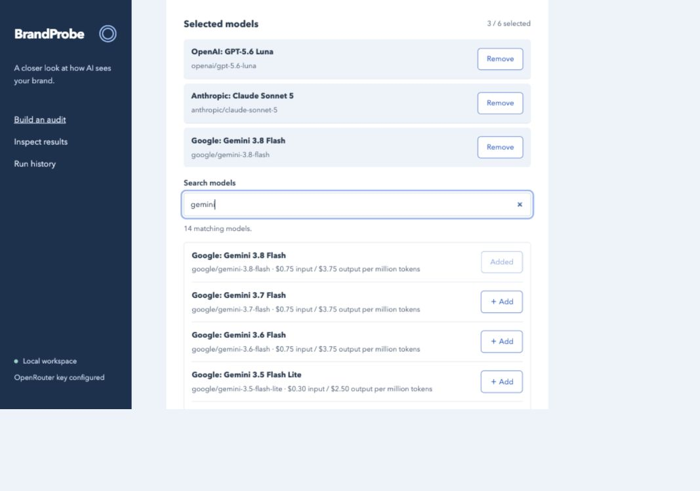

# BrandProbe

**Does AI know your brand—and does it bring it up when people ask for recommendations?**

BrandProbe is a local tool for exploring those questions across different AI models. Ask about a brand directly, try the questions its audience would ask, and compare the answers with mentions of other organizations. Every result keeps the original response so you can inspect what the model actually said.

A model saying “I don’t know this brand” still mentions its name. BrandProbe separates a name appearing in an answer from a model describing or recommending the organization.

**Status: early working prototype.** Model generation and scoring have been tested with live API requests. Search and reference-fact checks have automated tests but have not yet been validated with live provider calls. This is a research aid, not a universal AI visibility score.

**Start here:** [Step-by-step guide with screenshots and a three-model example](docs/USAGE.md).



## What you can explore

| Question | How BrandProbe helps |
| --- | --- |
| Does a model recognize my brand? | Ask directly, then inspect its description, uncertainty, and optional scoring evidence. |
| Does my brand come up naturally? | Ask questions that do not name it and count mentions in successful answers. |
| Which other brands appear? | Compare exact mentions on a shared set of unprompted questions. |
| Does an answer agree with my reference facts? | Supply approved statements and sources; a scoring model checks agreement or conflict with quoted evidence. |
| Does my website appear in Brave Search? | Run a separate search snapshot and inspect domain positions in the returned results. |

The browser includes model search, Add/Remove controls, editable questions, cost previews, run history, and HTML/JSON/CSV exports. You can start with a synthetic demo without API keys or charges.

## Try it locally

Requires [uv](https://docs.astral.sh/uv/getting-started/installation/) and Git on **Windows, macOS, or Linux**. uv can install Python 3.13 for you. Native Windows locking is supported; a Windows/macOS/Linux CI matrix is included. This change has been tested locally on macOS; Windows CI has not yet been run.

```sh
git clone https://github.com/authentic-research-partners/brand-probe.git
cd brand-probe
uv python install 3.13
uv sync --locked
uv run brandprobe serve
```

The commands above also work in Windows PowerShell—no environment activation is needed. Keep the terminal open while using the app.

Open **http://127.0.0.1:8765**. The browser starts in Demo mode. Preview the audit and run the synthetic example to explore the interface without contacting model providers. Synthetic results are labeled and are not findings about the example brand.

The included configurations use [Society of Teen Scientists](https://teenscientists.org/) as an example. Edit the brand, audience, questions, and comparison brands for your own study. The five-question pilot offers a smaller starting scope than the full fifteen-question example.

## Run a live audit

1. Copy the credential template:

   ```sh
   # macOS/Linux
   cp .env.example .env.local
   ```

   In Windows PowerShell, use `Copy-Item .env.example .env.local` instead. Do not overwrite an existing credentials file.

2. Add your OpenRouter key to `OPENROUTER_API_KEY` in `.env.local`.
3. Choose **Live** in the browser. The public model catalog loads automatically. Search by model name or provider and click **Add** for each model you want to compare.
4. Review the questions and choose an optional scoring model. Start with a few questions and repetitions.
5. Click **Preview audit**, review the request counts and price reservation, then explicitly approve the run.

Use the full brand name for recognition questions. Each answer starts a fresh conversation: an acronym-only question tests whether the model can identify that acronym, not whether it remembers a brand introduced in another question.

The scoring model reads the question and answer separately and classifies recognition or recommendation with supporting quotes. Its requests are included in the price preview. Scores are judgments, not verified facts; inspect the evidence before sharing conclusions.

### Costs and local data

- Catalog loading and Demo mode do not incur model inference charges.
- Live previews include generation, optional scoring, and configured search requests. The per-run budget is set in the form or TOML configuration.
- Reservations include a buffer but are not a provider billing guarantee. Unknown model billing stops new dispatches; requests already in flight may still finish and incur charges.
- Failed calls are not automatically retried. Brave costs are estimates based on the subscription rate you enter, separate from recorded model billing.
- Credentials stay in environment variables or ignored `.env` files. Local audit evidence is stored in `.brandprobe/history.db`; CLI exports go into `.brandprobe/reports/`.
- Your questions are sent to the selected model provider through OpenRouter. Scoring also sends the answers and any approved reference facts to the evaluator. Search queries go to Brave. Review your inputs before sending confidential material.

## Optional comparisons, facts, and search

**Comparison brands:** add names, domains, and aliases under “Comparison brands and reference facts.” Counts use successful unprompted answers and exclude questions naming any compared brand. They count mentions, not competitor endorsements.

**Reference checks:** add concise factual statements, source URLs, and review dates; approve them and select a scoring model. Reference facts are sent only to the evaluator, never to the models answering the audit questions. A supported or contradicted label requires quotes from both the answer and reference. These checks do not independently verify the source or check every possible claim. Start with a few facts to avoid exhausting the scoring output limit.

**Brave Search:** add `BRAVE_SEARCH_API_KEY` to `.env.local`, enter search queries, and confirm your subscription price. Results remain separate from model answers. The report records up to twenty first-page results per query; absence from that page does not establish absence from the search index.

## Read results carefully

- Recognition questions and spontaneous discovery use separate denominators.
- A description can sound knowledgeable while being generic or inaccurate. “Recognized” does not prove factual knowledge.
- Errors, truncated answers, and missing assessments are excluded rather than counted as negative findings.
- Repetitions are repeated samples of the same questions, not additional distinct questions.
- These are API model responses with search disabled. They do not reproduce the ChatGPT, Claude, or Gemini consumer applications, their personalization, or their browsing behavior.
- Results depend on the questions, model versions, and inference settings. Record those settings when comparing experiments.

## Command-line use

```sh
uv run brandprobe demo
uv run brandprobe models
uv run brandprobe plan --config examples/sots-pilot.toml
uv run brandprobe run --config examples/sots-pilot.toml
```

`plan` previews costs without inference. `run` requires typing `RUN` before making paid requests. Repeat `--model PROVIDER/MODEL_ID` to override the configured models. Model availability and prices are checked at preview time.

## Interrupted runs

After an unexpected shutdown, the next server startup classifies abandoned runs while holding an exclusive local worker lock. `brandprobe recover` performs the same check without paid calls.

History offers **Preview remaining work** for eligible runs. A continuation requires a fresh price preview and approval and includes only never-dispatched generation work, plus scoring for those new answers. Completed or uncertain requests, old scoring, and search are not repeated. The original report is preserved. Legacy runs without a dispatch journal cannot safely continue this way.

Keep one local instance per workspace. Restart the server after backend updates and refresh the browser after interface updates. This prototype binds to localhost and is not designed for public hosting or multiple users.

## Development

One Python package with Pydantic contracts, TOML settings, async HTTP, SQLite evidence, and thin CLI/FastAPI adapters. The browser uses plain HTML, CSS, and JavaScript. See [architecture](docs/ARCHITECTURE.md) and [MVP status](docs/MVP.md).

```sh
uv sync --locked --extra dev
uv run pytest -q
uv run ruff format --check .
uv run ruff check .
uv run mypy brandprobe
node --check brandprobe/static/app.js
```

Tests use fixtures and mocked HTTP, not paid API calls. **Node.js is also required for the model-picker tests.** The dependency lockfile is included. Trend comparisons, automatic source collection, and distributed job scheduling are outside the current MVP.

## License

[MIT](LICENSE). Copyright © 2026 BrandProbe contributors.
