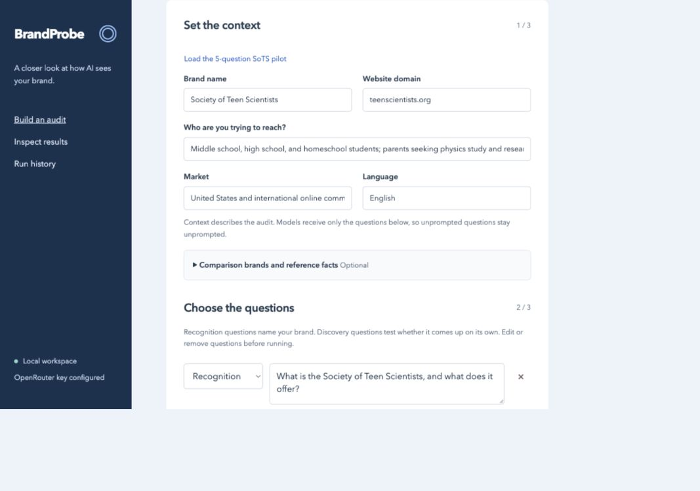
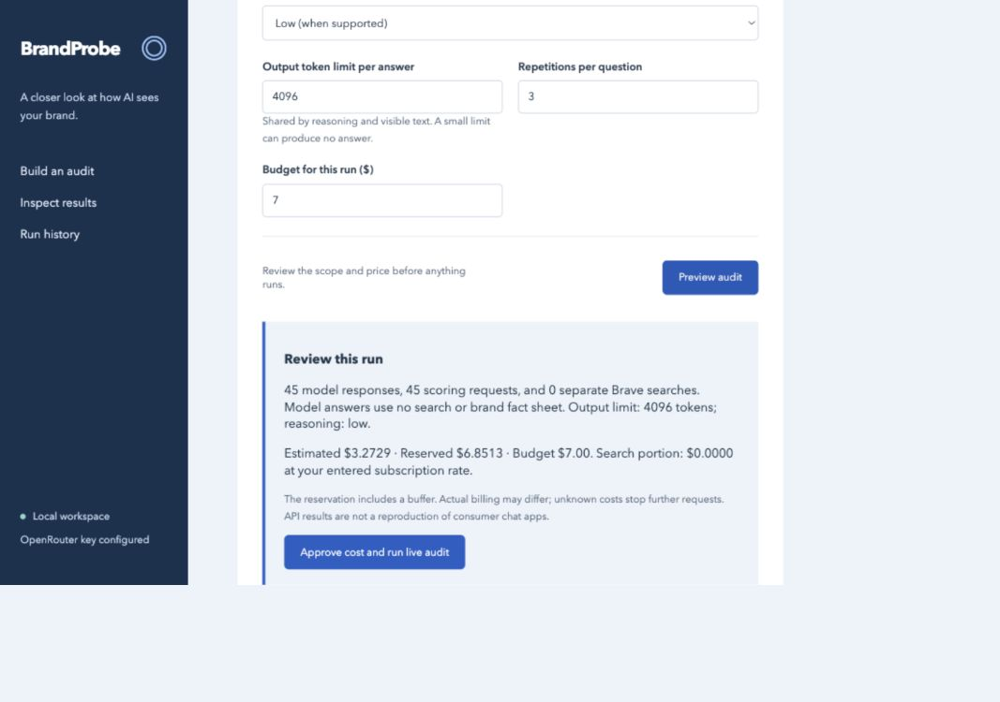
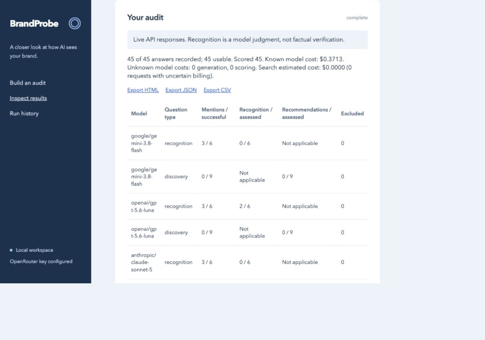
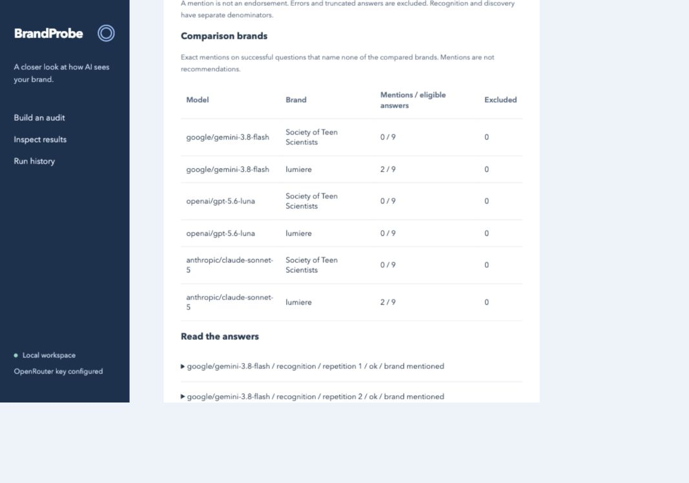

# Using BrandProbe: your first three-model audit

This walkthrough shows how to ask whether AI models recognize a brand and mention it in relevant recommendations. It uses **Society of Teen Scientists** as an example and compares it with **Lumiere Education**.

You can explore the interface in Demo mode without API keys. A live audit requires an OpenRouter key and explicit approval of its price preview.

## 1. Install and open the app

Install [Git](https://git-scm.com/downloads) and [uv](https://docs.astral.sh/uv/getting-started/installation/). If you just installed them, open a new terminal so it picks up the updated PATH.

The following commands work in **Windows PowerShell**, **macOS Terminal**, and a **Linux shell**:

```sh
git clone https://github.com/authentic-research-partners/brand-probe.git
cd brand-probe
uv python install 3.13
uv sync --locked
uv run brandprobe serve
```

Keep that terminal open and visit **http://127.0.0.1:8765** in your browser. `uv run` selects the project environment on every platform, so you do not need `source`, an activation script, or a PowerShell execution-policy change to activate a virtual environment.

Stop the server with **Ctrl+C** in the same terminal. To start again later, open that project folder in a terminal and run `uv run brandprobe serve`.

### Try it without a key

The app opens in **Try the demo** mode. Click **Preview audit**, then **Run synthetic demo**. No provider requests are sent. Synthetic results demonstrate the interface; they are not measurements of the example organization.

## 2. Configure a live API key

Copy the credential template once. Do not overwrite an existing file containing your keys.

**Windows PowerShell**

```powershell
Copy-Item .env.example .env.local
notepad .env.local
```

**macOS or Linux**

```sh
cp .env.example .env.local
```

Open `.env.local` in a text editor and set:

```dotenv
OPENROUTER_API_KEY=your-key-here
BRAVE_SEARCH_API_KEY=
```

Save it in the project root, alongside `pyproject.toml`. Leave Brave blank for this walkthrough; search is not required. Environment variables take precedence over `.env.local`. Do not put real keys in TOML files, screenshots, or Git commits.

Refresh the browser after saving. The sidebar should report that the OpenRouter key is configured. This confirms a key was found, not that the account has credit or access to every model.

## 3. Load the example and review its questions

Click **Load the 5-question SoTS pilot**. It loads [examples/sots-pilot.toml](../examples/sots-pilot.toml), switches to Live mode, and selects the example models and settings. It does **not** start an audit.



For a different brand, replace the name, domain, audience, and questions. The context fields describe the study; they are not secretly inserted into model answers.

The example contains:

| Type | Question |
| --- | --- |
| Recognition | What is the Society of Teen Scientists, and what does it offer? |
| Recognition | What do you know about physics education at Society of Teen Scientists? |
| Discovery | Which online communities let teenagers share and discuss original scientific research? |
| Discovery | Where can a high school student work on authentic physics research with scientists? |
| Discovery | Where can a motivated middle school student study advanced physics with expert guidance? |

Recognition questions deliberately name the brand. Discovery questions do not. Each request is a **fresh conversation**: a model cannot remember the brand name from an earlier question. Use the full name unless you intentionally want to test an acronym.

Open **Comparison brands and reference facts** to review the example competitor: Lumiere Education, domain `lumiere-education.com`, alias `Lumiere`. Change it to brands relevant to your market. Comparison counts exclude questions that name any compared brand.

## 4. Choose models and scoring

The example selects:

| Role | Model ID |
| --- | --- |
| Answer model | `openai/gpt-5.6-luna` |
| Answer model | `anthropic/claude-sonnet-5` |
| Answer model | `google/gemini-3.8-flash` |
| Scoring model | `anthropic/claude-sonnet-5` |

These are example choices, not permanent requirements. Availability and supported settings can change; the preview checks the current catalog.

Type a name or provider into **Search models**. Click **＋ Add** to move a model into the selected list above. **Remove** takes it out. Searching does not clear your selections, and you can select up to six models.


The scoring model is a separate selection. It reads each answer afterward and classifies recognition or recommendation with quoted evidence. It adds scoring calls, not a fourth set of original answers. It can make mistakes, so inspect its reasoning and quotes.

Keep these starting settings:

- **Repetitions:** 3.
- **Reasoning effort:** Low.
- **Output token limit:** 4,096 per answer.
- **Budget:** $7 for the complete example, subject to its current preview.
- **Brave queries and reference facts:** empty for this first run.

Five questions × three answer models × three repetitions = **45 answers**. Scoring adds up to **45 more requests**. Only three of the five questions are discovery questions, so there are nine discovery answers per model, or 27 across all three.

## 5. Preview before spending

Click **Preview audit**. Review the number of answers, scoring calls, search calls, reasoning setting, estimated price, and conservative reservation.



At the time this screenshot was captured, the estimate was about **$3.27** and the reservation about **$6.85**. Prices and output lengths change, so your preview may differ. The reservation assumes generous input/output usage and a buffer; it is not the expected bill. The $7 setting is a budget ceiling, not permission to spend account credit outside this run.

If the reservation exceeds the budget, reduce the questions or repetitions, select a less expensive scoring model, or deliberately raise the limit and preview again. A $5 cap is too low for the reservation shown here.

Only **Approve cost and run live audit** starts paid requests. The screenshots in this guide were made by previewing the setup and inspecting an existing report; no additional paid run was launched to make the guide.

## 6. Read the report

Wait for acquisition and scoring to finish. Keep the server running. You can revisit the audit through **Run history → Inspect**.



Read the table headings carefully:

- **Mentions / successful:** exact brand mentions in usable responses.
- **Recognition / assessed:** answers the scorer classifies as describing the brand, among assessed recognition answers. This does not establish factual accuracy.
- **Recommendations / assessed:** unprompted answers classified as recommending the target.
- **Excluded:** unsuccessful responses omitted from those denominators. They are not counted as evidence of absence.

Open an item under **Read the answers** to inspect the original question, answer, scoring explanation, and supporting quote. A response that says “I don’t know this organization” can contain a name mention while correctly receiving an unrecognized label.

### Reading the competitor comparison



This screenshot is from an **earlier completed live run on September 20, 2026**, not a promised outcome of rerunning the current preset. Its three discovery questions match this walkthrough. In that sample:

| Model | Society of Teen Scientists | Lumiere |
| --- | --- | --- |
| Gemini 3.8 Flash | 0 / 9 | 2 / 9 |
| GPT-5.6 Luna | 0 / 9 | 0 / 9 |
| Claude Sonnet 5 | 0 / 9 | 2 / 9 |

A defensible description is: **“In this small sample of three discovery questions repeated three times across three models, the target was absent from all 27 answers, while the comparison brand appeared in four.”**

Do not turn this into “the brand has zero AI visibility.” These are selected questions, repeated samples, and API answers with search disabled—not the consumer ChatGPT, Claude, or Gemini apps.

The earlier report also used an acronym-only recognition question, “What programs for high school SoTS has?” All models asked for clarification or interpreted the acronym differently. The current preset uses the full brand name for both recognition questions. Treat that older acronym result separately; its combined recognition denominator does not measure only full-name recognition.

Two of that run’s GPT answers were classified as recognized but were generic descriptions. No reference fact sheet was used to establish their accuracy. The run’s recorded $0.3713 cost is historical, not a quote for your next audit.

## 7. Export and share

- **Export HTML:** a readable, portable report with tables and expandable evidence.
- **Export JSON:** full structured evidence and run configuration for analysis.
- **Export CSV:** rows for spreadsheet analysis; search and model channels are labeled separately.

For a nontechnical reader, lead with one finding and a screenshot of the relevant table. Include the models, question scope, repetitions, and whether search was used. Keep the full report available for anyone who wants to inspect the evidence.

## Optional: reference facts and Brave Search

After the first run, add only the features needed for your question:

**Reference facts:** enter short statements, source URLs and review dates; approve them and choose a scoring model. The evaluator checks agreement/conflict with those references. The app does not independently verify the source or check every possible claim. Adding facts changes the scoring workload; create a new preview.

**Brave Search:** configure `BRAVE_SEARCH_API_KEY`, enter queries, and confirm your subscription rate. Search results and estimated search costs remain separate. They never enter the no-search model answers. A first-page domain rank is not proof that a consumer AI application will find or recommend the brand.

## Troubleshooting

| Symptom | What to do |
| --- | --- |
| `uv` or `git` is not recognized | Install the missing tool and reopen the terminal. |
| Browser cannot connect | Run `uv run brandprobe serve` from the project directory and keep that terminal open. |
| Port 8765 is already occupied | Use `uv run brandprobe serve --port 8766`, then open the matching address. |
| New fields are rejected after updating | Restart the old server with Ctrl+C and `uv run brandprobe serve`, then refresh the page. Save custom entries first. |
| Model catalog fails to load | Click Retry; Demo mode works offline. |
| Low reasoning is unsupported | Choose a supported effort or Provider defaults and create a new preview. |
| Token-limit/truncated response | Lower reasoning effort or raise the output limit before a new preview. Increasing tokens also changes cost. |
| Provider HTTP 429 | The provider rejected a request due to a limit. Wait and check account/provider limits; repeated immediate runs may fail again. |
| Partial run or unknown billing | Inspect the report. Do not interpret missing answers as negative findings; uncertain calls are not automatically retried. |
| Another worker is active | Let the existing worker finish. Do not delete the lock file to force a second worker. |

## Command-line equivalent

These commands work unchanged in PowerShell, macOS, and Linux:

```sh
uv run brandprobe plan --config examples/sots-pilot.toml
uv run brandprobe run --config examples/sots-pilot.toml
```

`plan` previews prices without model inference. `run` requires typing `RUN` before dispatching paid requests. To try the example configuration with synthetic responses instead:

```sh
uv run brandprobe demo --config examples/sots-pilot.toml
```

Demo uses fixture models and no semantic evaluator; it does not test the live models listed in the configuration.
